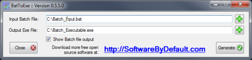

# BatToExe

BatToExe is a no frills Windows Forms application written in C# that converts batch (*.bat) files to executables (*.exe). The main functionality centers around runtime compilation in C#. It is open source under a Microsoft Public License.

Project hosted on SourceForge at https://sourceforge.net/projects/bat-to-exe/

Author's website at https://softwarebydefault.com/open-source-projects/battoexe/

<figure>
  <figcaption>BatToExe Screenshot</figcaption>
  </figure>
  
